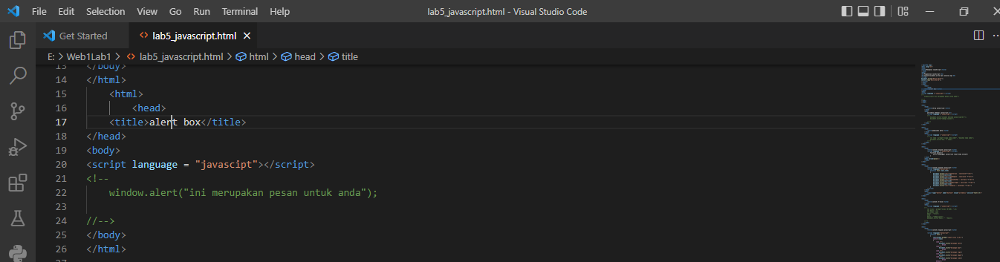

Nama    : MUHAMMAD FERDI HERDIANSYAH
NIM     :312010038
Kelas   :TI.20 D1
Mata Pel:PEMOGRAMAN WEB
Dosen   :AGUNG NUGROHO,S.Kom.,M.Kom

Persiapan membuat dokumen HTML dengan nama file lab_javascript.html seperti berikut.

 
 
 
 JAVA SCRIPT DASAR
 Pemakaian alert sebagai property window.
 

PEMAKAIAN METHOD DALAM OBJEK

PEMAKAIAN PROMPT

PEMBUATAN FUNGSI DAN CARA PEMANGGILNYA

DASAR PEMOGRAMAN DI JAVA SCRIPT
OPERASI DASAR ARITMATIKA

SELEKSI KONDISI (if.else)

PENGUNAAN OPERATOR SWITCH UNTUK SELEKSI KONDISI

PEMBUATAN FORM 

FOMR INPUT

FORM BUTTON

HTML DOM
PILIHAN MENGGUNAKAN CHECKBOX DENGAN PERHITUNGAN OTOMATIS.

PERTANYAAN TUGAS.
1. BUATLAH SCRIPT UNTUK MELAKUKAN VALIDASI PADA ISIAN FORM

